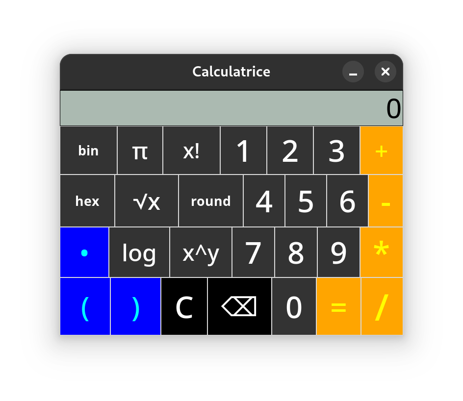

# 🧮 Calculatrice Python avec Interface Graphique

## 📝 Description
Une calculatrice complète avec interface graphique développée en Python utilisant la bibliothèque Tkinter. Cette application offre toutes les fonctionnalités d'une calculatrice scientifique moderne avec une interface simple et intuitive.

## ✨ Fonctionnalités
- ➕ Opérations arithmétiques de base (addition, soustraction, multiplication, division)
- 📊 Fonctions mathématiques avancées:
  - 📐 Racine carrée
  - 📏 Puissance (x^y)
  - 🔄 Factorielle (x!)
  - 📉 Logarithme (base 10)
  - ⭕ Pi (π)
  - 🔢 Arrondi (round)
- 💻 Conversions:
  - 🔟 Décimal vers Hexadécimal
  - 0️⃣1️⃣ Décimal vers Binaire
- 🧩 Support complet des parenthèses pour les expressions complexes
- ⌨️ Entrée possible au clavier ou via les boutons
- 🚫 Gestion des erreurs avec messages explicatifs

## 🖼️ Aperçu


## 🚀 Installation
1. Assurez-vous d'avoir Python installé sur votre ordinateur
2. Clonez ce dépôt:
   ```bash
   git clone https://github.com/RobinHil/py-calculator.py
   ```
3. Naviguez vers le dossier du projet:
   ```bash
   cd py-calculator
   ```
4. Lancez l'application:
   ```bash
   python calculator.py
   ```

## 🔧 Prérequis
- Python 3.x
- Tkinter (généralement inclus dans l'installation standard de Python)